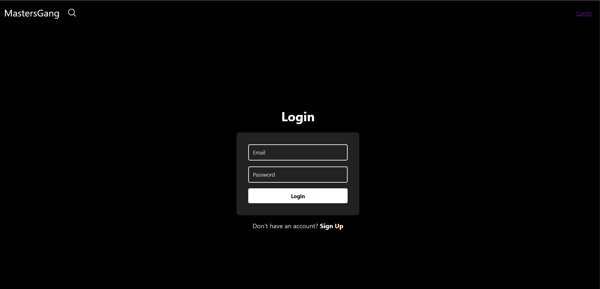
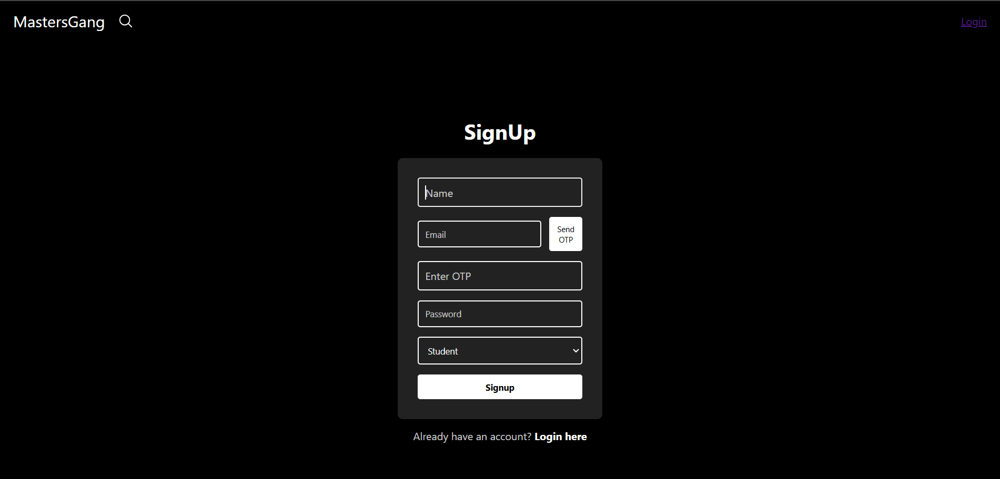
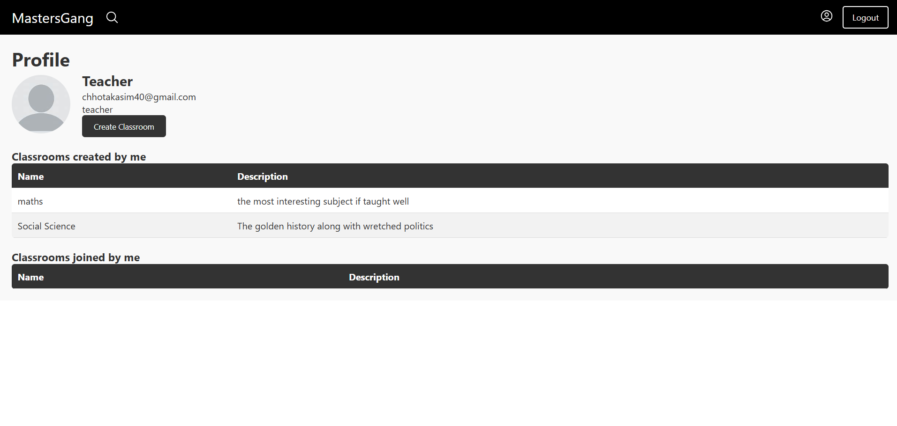
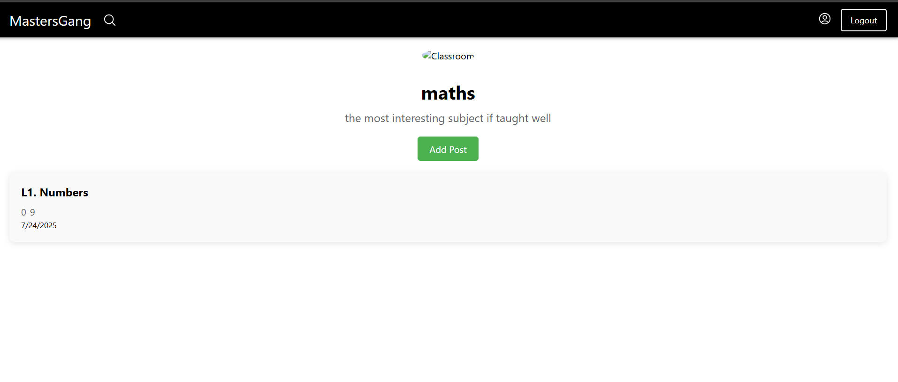
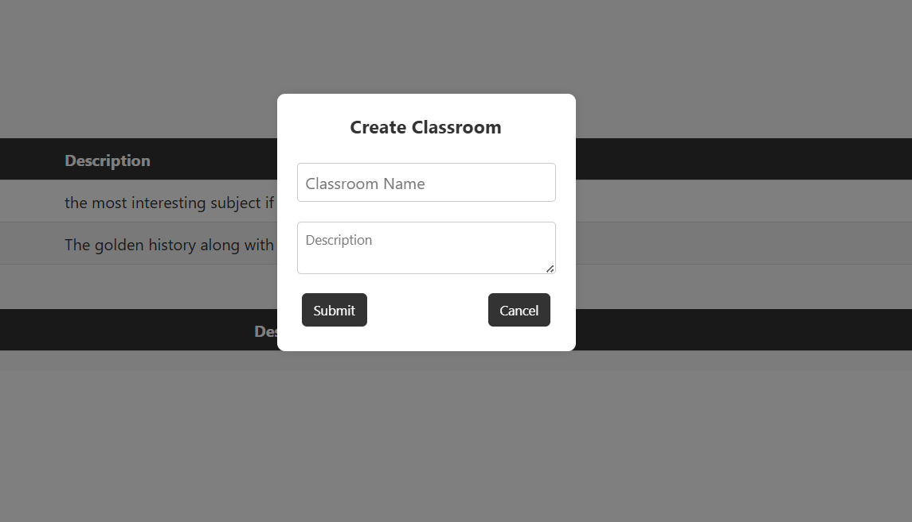
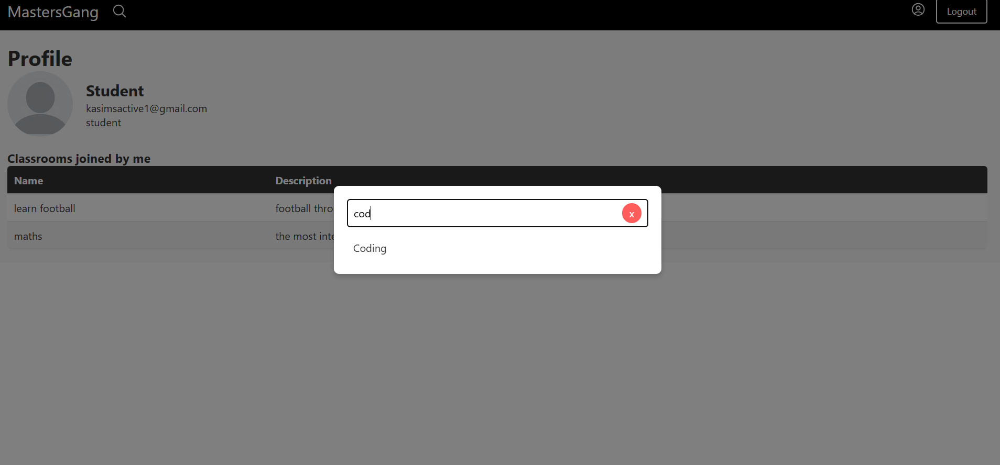
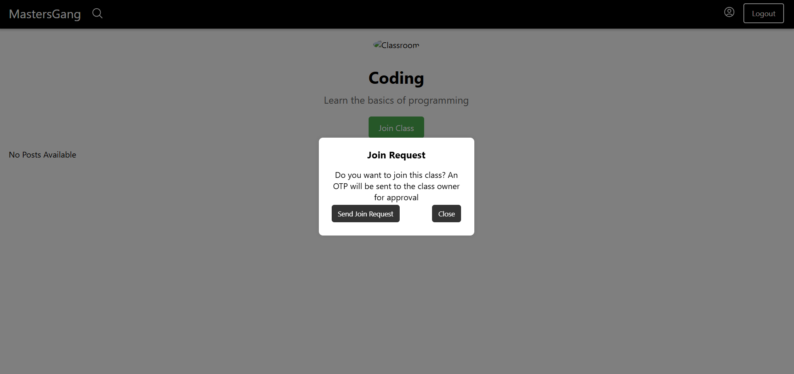
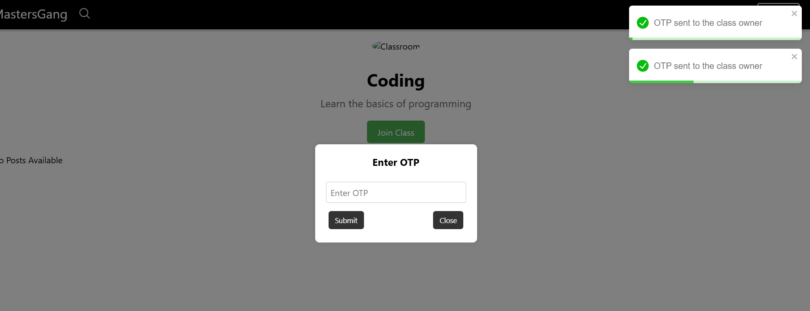

# Teachers Forum - MERN Stack Platform

A collaborative platform for teachers and students to connect, share study materials, and discuss academic topics seamlessly. Built with the MERN stack and deployed on Vercel.

🔗 **Live Demo:** [https://teachers-forum-wzkq.vercel.app/](https://teachers-forum-wzkq.vercel.app/)
Teacher's Login: username-- chhotakasim40@gmail.com
password-- teacher
Student's Login: username-- kasimsactive1@gmail.com
password-- student

## Key Features

- **User Authentication**: Secure login/signup with JWT and role-based access control
- **Study Material Hub**: Upload, organize, and with categorization
- **Discussion Forums**: Thread-based discussions for academic queries
- **Persistent Login**: Implemented using localStorage for seamless user experience
- **OTP Verification**: _Nodemailer_-powered email OTP system for secure authentication
- **Responsive Design**: Fully functional across all device sizes

## Application Walkthrough

➡️ **Landing Page/Login**  


➡️ **SignUp Page**  


➡️ **Teacher Dashboard**  


➡️ **Classroom View**  


➡️ **Create Classroom Popup**  


➡️ **SearchBar**  


➡️ **Join New Classroom**  


➡️ **OTP To Classroom Owner**  


## Technologies Used

### Frontend

- React.js (Vite)
- React Context API (State management)
- Vanilla CSS (Styling)
- React Router (Navigation)
- Fetch (HTTP requests)

### Backend

- Node.js & Express.js
- MongoDB (Database)
- Mongoose (ODM)
- JWT (Authentication)
- Nodemailer (OTP service)
- Bcrypt (Password hashing)

### Deployment

- Vercel (Frontend)
- Vercel (Backend)
- MongoDB Atlas (Cloud Database)

## Key Learnings

Through building this project, I gained hands-on experience with:

- Implementing secure authentication flows (JWT, localStorage persistence)
- Developing role-based access control (Teacher vs Student permissions)
- Notes upload functionality with proper storage management
- Integrating third-party services (Nodemailer for email OTP)
- State management with Context API
- Error handling and data validation on both client and server
- Deployment of full-stack applications (Vercel + backend service)

## Installation

To run this project locally:

### Prerequisites

- Node.js (v16+)
- MongoDB (local or Atlas URI)
- SMTP credentials for Nodemailer(via Google)

### Setup Instructions

1. Clone the repository:

   ```bash
   git clone https://github.com/your-username/teachers-forum.git
   ```

2. Set up backend:

   ```bash
   cd server
   npm install
   cp .env.example .env # Update with your credentials
   ```

3. Set up frontend:

   ```bash
   cd ../client
   npm install
   cp .env.example .env # Update with your API endpoints
   ```

4. Run the application:

   ```bash
   # In server directory:
   nodemon index.js

   # In client directory:
   npm run dev
   ```

## Project Structure

```
teachers-forum/
├── frontend/              # Frontend (React)
│   ├── public/
│   ├── src/
│   │   ├── components/  # Reusable UI components
│   │   ├── context/     # React Context
│   │   └── pages/       # Route components
│   │
│   └── vercel.json
│
├── backend/              # Backend (Express)
│   ├── controllers/
│   ├── models/
│   ├── routes/
│   ├── middleware/
│   ├── utils/
│   ├── db.js
│   ├── vercel.json
│   └── index.js
│
└── README.md
```

## Future Enhancements

- [ ] Implement real-time chat functionality
- [ ] Add video conferencing integration
- [ ] Introduce AI-powered Q&A assistance
- [ ] Develop mobile application version
- [ ] Add analytics dashboard for teachers

## License

This project is open-source and available under the [MIT License](./LICENSE).

---

✨ Developed by [Kasim Chhota] - [https://kasim-portfolio.netlify.app/]
